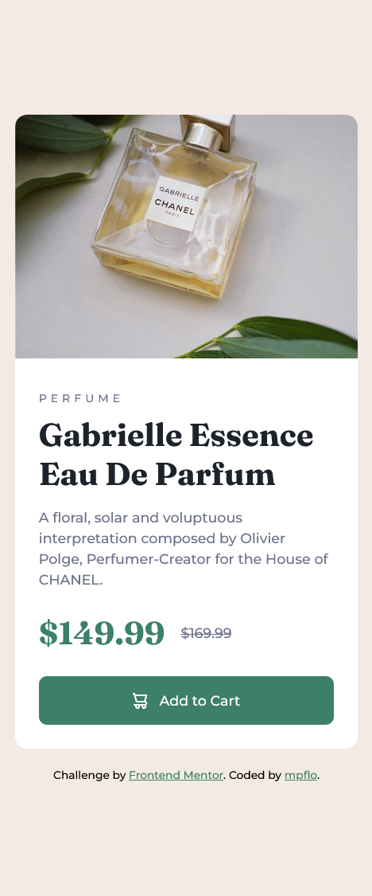
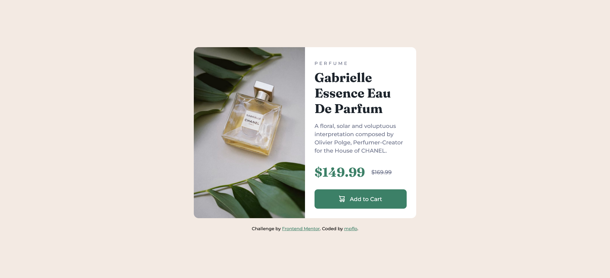

# Frontend Mentor - Product preview card component solution

This is a solution to the [Product preview card component challenge on Frontend Mentor](https://www.frontendmentor.io/challenges/product-preview-card-component-GO7UmttRfa). Frontend Mentor challenges help you improve your coding skills by building realistic projects. 

## Table of contents

- [Overview](#overview)
  - [The challenge](#the-challenge)
  - [Screenshot](#screenshot)
  - [Links](#links)
- [My process](#my-process)
  - [Built with](#built-with)
  - [What I learned](#what-i-learned)
  - [Continued development](#continued-development)

## Overview

### The challenge

In this challenge, we have a box that on smaller screens is in one column, and on larger screens is in two columns. It is a box with an image, a link and a simple description of the product.

### Screenshot

## Project on mobile

## Project on mobile

### Links

- Solution URL: [Project's repo](https://github.com/mpflo/product-preview-card-component)
- Live Site URL: [Project's live site](https://your-live-site-url.com)

## My process

### Built with

- Semantic HTML markup
- Flexbox
- CSS

### What I learned

In this project, I decided to do something different and use the <picture> and <source> tags to be able to set different breakpoints for the images. The idea was to simplify this process as there were two different images for two breakpoints.
Overall, it was an easy project, where Flexbox helped transform the columns of the main box and also elements of the content itself.

### Continued development

I will continue to look for ways to improve the responsiveness of the blocks and also deepen my knowledge of Flexbox.

## Author

- Website - [My GitHub Page](https://github.com/mpflo)
- Frontend Mentor - [@qipeot](https://www.frontendmentor.io/profile/qipeot)
